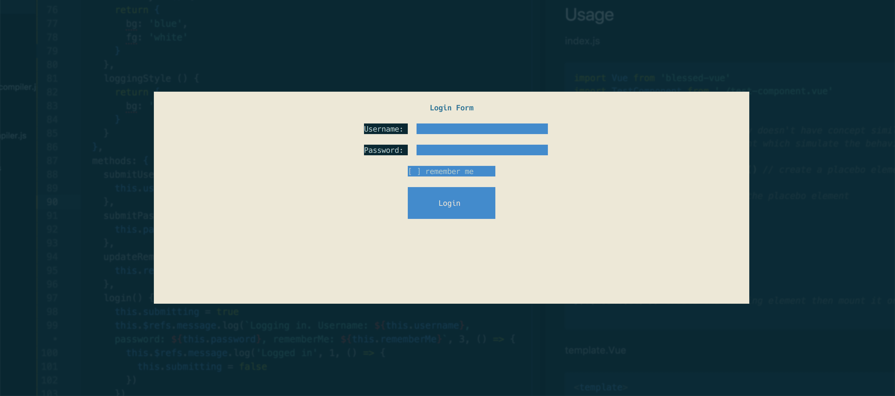
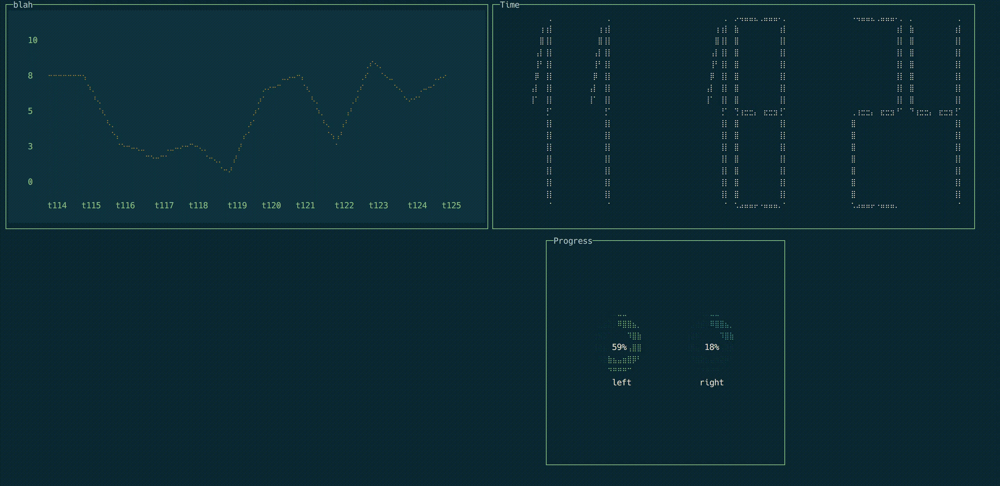

# blessed-vue [](https://travis-ci.org/lyonlai/blessed-vue) [](https://david-dm.org/boennemann/badges) [](https://badge.fury.io/js/blessed-vue)

Compile against **[VueJS 2.5.13](https://github.com/vuejs/vue/releases/tag/v2.5.13)**.

This package is a Vue.js runtime for [blessed](https://github.com/chjj/blessed) and now [blessed-contrib](https://github.com/yaronn/blessed-contrib). The current version is compiled against VueJS 2.5.13, which means those lovely features and bug fixes comes with v2.5.13 in vue core will be available in the current version. For example, the lovely improvements about the functional components.

Blessed is a great replacement for [ncurses](https://en.wikipedia.org/wiki/Ncurses) in building UI for terminal interface in Javascript. The intention of creating this runtime is to bring declarative templates and reactive components of VueJS to simplify the layout of blessed components.

blessed-contrib is an extension of blessed with custom [drawllie](https://github.com/madbence/node-drawille) widgets to make building dashboard easy in command line.

This package is inspired by [react-blessed](https://github.com/Yomguithereal/react-blessed).

## Table of content
- [Features](#features)
  - [Supported Element](#supported-elements)
  - [Style](#style)
    - [Static string style](#static-string-style)
    - [Array style binding](#static-string-style)
    - [Object style](#object-style)
- [Installation](#installation)
- [Example](#example)
  - [Configuration for rollup-plugin-vue](#configuration-for-rollup-plugin-vue)
  - [Screenshots](#screenshots)
    - [Login](#login)
    - [Dashboard](#dashboard)

## Features
### Supported Element
All the widgets in [blessed widgets](https://github.com/chjj/blessed#widgets) and [blessed-contrib widgets](https://github.com/yaronn/blessed-contrib#widgets) should be supported out of the box. For details of what attributes are available for each element, please refer to the specific widget in  [blessed document](https://github.com/chjj/blessed) or [blessed-contrib document](https://github.com/yaronn/blessed-contrib).


### Style
The styling in Blessed Vue is not quite like CSS in the Web. In CSS the style you define on the parent can cascade/flow down to its children down the DOM tree, where in blessed the style is only used by the element it is defined on.

You can style your blessed element in the following ways.

#### Static string style
If you don't need value binding in your element style. Blessed Vue supports string style definition. For nested value like focus, hover, scrollbar, etc..., you can use dot style to specify the nested value. See the following example.

```html
<box style='bg: white; fg: black; hover.bg: black; hover.fg: white'/>
```

#### Array style binding
```html
<template>
  <box :style="[baseStyle, isLoading && loadingStyle]" />
</template>

<script>
export default {
  ...
  data: {
    isLoading: false
  }
  computed: {
    baseStyle () {
      return {
        bg: 'blue',
        fg: 'white'
      }
    },
    loadingStyle () {
      return {
        bg: 'yellow'
      }
    }
  }
  ...
}
</script>
```

#### Object style
```html
<template>
  <box :style="objectStyle" />
</template>

<script>
export default {
  ...
  computed: {
    objectStyle () {
      return {
        bg: 'blue',
        fg: 'white',
        hover: {
          bg: 'red'
        }
      }
    }
  }
  ...
}
</script>
```

## Installation

``` bash
npm install blessed-vue
```

## Example

The following example consists of two files. `index.js` & `test-component.vue`. At the moment blessed-vue shares the same template compiler with web runtime. So in order to load the [single file component](https://vuejs.org/v2/guide/single-file-components.html), you can use either [vue-loader](https://github.com/vuejs/vue-loader) when you are using [webpack](https://webpack.github.io/), or [rollup-plugin-vue](https://github.com/vuejs/rollup-plugin-vue) when you are using [rollup](https://rollupjs.org/).

### Configuration for rollup-plugin-vue
There are two lines of config you need to put into rollup-plugin-vue to get blessed-vue working properly. The full example is available in the login example.

```javascript
// rollup.config.js

import vue from 'rollup-plugin-vue';
// more imports

export default {
  entry: 'src/index.js',
  dest: 'bundle.js', // equivalent to --output
  ..., // more configs.
  plugins: [
    vue({
      htmlMinifier: {
        caseSensitive: true, // turn on the case sensitive for preserving the props
        keepClosingSlash: true // keep the singleton elements working.
      }
    }),
    ... // more plugins
  ],
  ...
};

```

There are examples available in [example folder](https://github.com/lyonlai/blessed-vue/tree/master/examples).

* login: Full example shown in README.md using rollup. (*Using official plugin rollup-plugin-vue now.*)
* call-log: an example of webpack & vue-loader.
* dashboard: an example of how to use blessed-contrib element to build a command line dashboard.

### Screenshots

#### Login


#### Dashboard



### index.js

```Javascript
import Vue from 'blessed-vue'
import TestComponent from './test-component.vue'

/*
Due the fact that Blessed library doesn't have concept similar to web dom.
Blessed Vue provided a dom element which simulate the behaviour of a web dom to mount the component on.
*/
const el = Vue.dom.createElement() // create a placebo element for Blessed Vue to append on

Vue.dom.append(el) // attaching the placebo element

const instance = new Vue({
  name: 'app',
  components: {
    TestComponent
  },
  template: '<test-component />'
}).$mount(el) // create the landing element then mount it on the placebo one
```

### template.vue
```html
<template>
  <screen ref='screen' :smartCSR="true" :keys="true">
    <form top="center" left="center" width="50%" :height="20" :keys="true" :mouse="true" style="bg: white">
      <box :width="50" :height="1" :top="1" left="center" align="center" content="Login Form" style="bg: white; fg: black; bold: true" />
      <text :top="3" left="50%-20" style="bold: true">Username: </text>
      <textbox :keys="true" :mouse="true" ref='username'
              :top="3" left="50%-8" :length="10" :width="30" :height="1"
              :value="username" @submit="submitUsername"
              style="bg: blue; fg: white"/>
      <text :top="5" left="50%-20" style="bold: true">Password: </text>
      <textbox :keys="true" :mouse="true" ref='password'
              :top="5" left="50%-8" :length="10" :width="30" :height="1"
              :value="password" @submit="submitPassword"
              style="bg: blue; fg: white" :censor="true"/>
      <checkbox :keys="true" :mouse="true" :top="7" left="center"
              :checked="rememberMe" @check="updateRememberMe(true)" @uncheck="updateRememberMe(false)"
              text='remember me' :width="20" :height="1"
              style="bg: blue"/>
      <button :keys="true" :mouse="true" content="Login"
              :width="20" :height="3" :top="9" left="center"
              align="center" valign="middle"
              :style="[buttonStyle, submitting && loggingStyle]"
              @press="login"/>
      <message ref="message" top="center" left="center" :width="50" :height="5" align="center" valign="middle"/>
    </form>
  </screen>
</template>

<script>
export default {
  name: 'test-component',
  data: {
    username: '',
    password: '',
    rememberMe: false,
    submitting: false
  },
  computed: {
    buttonStyle () {
      return {
        bg: 'blue',
        fg: 'white'
      }
    },
    loggingStyle () {
      return {
        bg: 'grey'
      }
    }
  },
  methods: {
    submitUsername(username) {
      this.username = username
    },
    submitPassword(password) {
      this.password = password
    },
    updateRememberMe(val) {
      this.rememberMe = val
    },
    login() {
      this.submitting = true
      this.$refs.message.log(`Logging in. Username: ${this.username}, password: ${this.password}, rememberMe: ${this.rememberMe}`, 3, () => {
        this.$refs.message.log('Logged in', 1, () => {
          this.submitting = false
        })
      })
    }
  },
  mounted () {
    this.$refs.screen.key(['C-c'], () => {
      process.exit(0)
    })
    this.$refs.username.focus()
    this.$refs.message.hide()
  }
}
</script>
```
